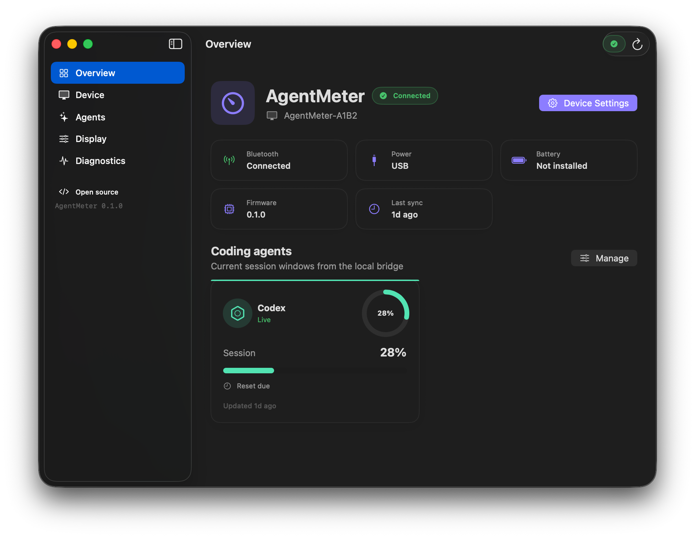
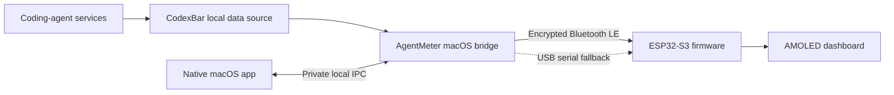

# AgentMeter

[](https://github.com/prabhavalabs/agentmeter/actions/workflows/ci.yml)
[](LICENSE)
[](docs/roadmap.md)

**AgentMeter is a small ESP32 desk display for live coding-agent quota windows, reset countdowns, and usage alerts.**

It pairs a 480×480 AMOLED touchscreen with a lightweight macOS bridge. Provider authentication stays on the computer; the display receives only the bounded, privacy-filtered values required by its interface.

The first hardware version is working end to end with Codex, Claude, Gemini, and Cursor data supplied by CodexBar. Bluetooth delivery, acknowledgement, reconnection, USB fallback, the dashboard UI, alerts, and launch-at-login installation are implemented. A native macOS companion adds menu-bar status, device connection management, live telemetry, and complete display controls in polished light and dark themes.



## What it shows

- Up to eight coding-agent providers in a responsive, scrollable overview
- Session, weekly, and other provider-defined quota windows
- Live reset countdowns maintained locally between updates
- Color progress indicators and deduplicated configurable threshold alerts
- Waiting, live, reconnecting, stale, unavailable, and provider-error states
- Touch-driven provider details, recognizable agent marks, and a physical-button fallback
- On-device agent visibility, always-on, full-view rotation, and rotation interval settings
- Configurable brightness, dimming, screen-off, and AMOLED pixel shifting

## Architecture



The host starts a bounded CodexBar loopback collection with a temporary bearer token only when an update is due, normalizes the selected providers, removes identity and billing fields, and transmits a document capped at 4096 bytes. Provider helpers are released between updates, while AgentMeter retains recent valid windows as visibly delayed data through transient failures. The firmware acknowledges a message only after complete reassembly and validation.

See [Architecture](docs/architecture.md) and [Device protocol](docs/protocol.md) for the complete design.

## Hardware

The first supported device is the **Waveshare ESP32-S3-Touch-AMOLED-2.16** with 8 MB PSRAM and 16 MB flash. The minimum build requires only:

- One display board
- One data-capable USB-C cable for flashing and power
- One Bluetooth-capable Mac

No separate Arduino, screen, Bluetooth module, breadboard, jumper wires, microSD card, or soldering is required. See the [hardware guide](docs/hardware.md) for the exact model and optional desk accessories.

## Quick start

For a release build, the only prerequisites are macOS 14 or later, a Bluetooth-capable Mac, and a
recent CodexBar installation. The signed application includes its own bridge runtime; Python and
the source repository are needed only for development.

```bash
git clone https://github.com/prabhavalabs/agentmeter.git
cd agentmeter
make setup

mkdir -p "$HOME/.config/AgentMeter"
cp config.example.toml "$HOME/.config/AgentMeter/config.toml"
.venv/bin/agentmeter doctor
.venv/bin/agentmeter snapshot --pretty
```

Connect the board, identify its ESP32 USB port, build, and flash:

```bash
.venv/bin/pio device list
make firmware
.venv/bin/pio run -d firmware -e waveshare_amoled_216 \
  --target upload --upload-port /dev/cu.usbmodemXXXX
```

The screen advertises a name such as `AgentMeter-7404`. Send one live update and allow Bluetooth access if macOS asks:

```bash
.venv/bin/agentmeter send
```

Once the display updates, install the isolated background bridge. It starts immediately and at each login:

```bash
.venv/bin/agentmeter service install --source .
.venv/bin/agentmeter service status
```

Build and open the native companion on macOS 14 or later. A local ServiceManagement test requires
an installed Apple Development signing identity:

```bash
CODE_SIGN_IDENTITY="Apple Development: Your Name (TEAMID)" make desktop-app
ditto desktop/dist/AgentMeter.app /Applications/AgentMeter.app
open /Applications/AgentMeter.app
```

On first launch, the app registers its bundled bridge and walks through Bluetooth, device, and
provider setup. An older repository-installed bridge is migrated automatically after the bundled
bridge is ready. See the [macOS companion guide](docs/macos-app.md) for screens, synthetic-data
development, packaging, and release signing.

The first uncached collection or Bluetooth pairing may take up to two minutes. Later updates reuse the bond and connection. Detailed instructions and troubleshooting are in [Setup](docs/setup.md) and [Host bridge](docs/host.md).

## Repository layout

```text
agentmeter/
├── firmware/       ESP32-S3 application, UI, protocol, and board support
├── host/           macOS bridge, transports, alert engine, and tests
├── desktop/        Native SwiftUI menu-bar app, tests, icon, and packaging
├── schemas/        Versioned device data contract
├── fixtures/       Safe synthetic payloads
├── docs/           Build, setup, architecture, and protocol guides
└── config.example.toml
```

## Project principles

- **Local by default:** provider credentials and raw responses stay on the computer.
- **Honest status:** stale or unavailable data is never presented as live usage.
- **Small scope:** one primary board, one simple protocol, and practical hobbyist tooling.
- **Original design:** reference projects inform the architecture, but their unlicensed code, branding, fonts, and artwork are not reused.
- **Contributor-friendly:** public contracts, synthetic fixtures, automated checks, and focused documentation.

## References

- [CodexBar](https://github.com/steipete/CodexBar) provides the local usage source and is distributed under the MIT License.
- [Clawdmeter](https://github.com/HermannBjorgvin/Clawdmeter) and the [Adafruit project article](https://blog.adafruit.com/2026/05/12/making-a-claude-usage-display-with-clawdmeter/) demonstrated the physical product concept. AgentMeter does not reuse its code or brand assets.

## Contributing

Contributions are welcome. Read [CONTRIBUTING.md](CONTRIBUTING.md) before opening an issue or pull request. Current work and future ideas are tracked in the [roadmap](docs/roadmap.md).

## Author and license

Created and maintained by **Nipun Theekshana** for [Prabhava Labs](https://prabhavalabs.com/).

AgentMeter is available under the [MIT License](LICENSE).
