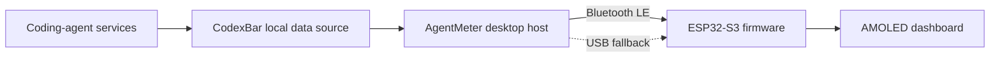

# AgentMeter

[](https://github.com/prabhavalabs/agentmeter/actions/workflows/ci.yml)
[](LICENSE)
[](docs/roadmap.md)

**AgentMeter is a small ESP32 desk display for live coding-agent quota windows, reset countdowns, and usage alerts.**

It pairs an attractive 480×480 AMOLED touchscreen with a lightweight desktop application. Provider authentication stays on the computer; the display receives only the small, normalized snapshot needed to draw the interface.

> Project status: hardware bring-up is in progress. The AMOLED, touch controller,
> power manager, user button, and external PSRAM are supported by the first
> on-device diagnostic.

## What it will show

- Current session, weekly, and other provider-defined usage windows
- Time remaining until each window resets
- Clear 75% and 90% usage alerts
- Live, stale, disconnected, and provider-error states
- Up to four providers, beginning with Codex, Claude, and Gemini
- A configurable overview and provider-detail layout

## Architecture



The desktop host collects and normalizes usage information, removes identity data, and sends a bounded JSON snapshot over Bluetooth Low Energy. The device maintains countdowns locally between updates and visibly marks old data instead of presenting it as current.

See [Architecture](docs/architecture.md) for the design and privacy boundaries.

## Hardware

The first supported device is the **Waveshare ESP32-S3-Touch-AMOLED-2.16**:

- ESP32-S3 with Wi-Fi and Bluetooth 5
- 2.16-inch 480×480 capacitive AMOLED touchscreen
- 8 MB PSRAM and 16 MB flash
- USB-C power and programming
- Integrated buttons, enclosure, power management, IMU, RTC, and audio hardware

The minimum build requires the display board and a USB-C data cable. See the complete [hardware guide](docs/hardware.md).

## Repository layout

```text
agentmeter/
├── firmware/       ESP32-S3 application and board support
├── host/           Desktop data bridge and tests
├── schemas/        Versioned device data contract
├── fixtures/       Safe sample payloads for development
├── docs/           Build, setup, architecture, and protocol guides
└── config.example.toml
```

## Getting started

The host scaffold requires Python 3.11 or later:

```bash
make setup
.venv/bin/agentmeter --version
make lint
make test
```

Firmware builds use [PlatformIO](https://platformio.org/):

```bash
make firmware
```

Detailed instructions are in [Setup](docs/setup.md) and [Development](docs/development.md).

## Project principles

- **Local by default:** provider credentials and raw responses stay on the computer.
- **Honest status:** stale or unavailable data is never displayed as live usage.
- **Small scope:** one primary board, one simple protocol, and practical hobbyist tooling.
- **Original design:** reference projects inform the architecture, but their unlicensed code, branding, fonts, and artwork are not reused.
- **Contributor-friendly:** public contracts, fixtures, automated checks, and focused documentation.

## References

- [CodexBar](https://github.com/steipete/CodexBar) provides the planned local, normalized usage source and is distributed under the MIT License.
- [Clawdmeter](https://github.com/HermannBjorgvin/Clawdmeter) and the [Adafruit project article](https://blog.adafruit.com/2026/05/12/making-a-claude-usage-display-with-clawdmeter/) demonstrated the physical product concept. AgentMeter does not reuse its code or brand assets.

## Contributing

Contributions are welcome. Read [CONTRIBUTING.md](CONTRIBUTING.md) before opening an issue or pull request. The planned work is tracked in the [roadmap](docs/roadmap.md).

## Author and license

Created and maintained by **Nipun Theekshana** for [Prabhava Labs](https://prabhavalabs.com/).

AgentMeter is available under the [MIT License](LICENSE).
