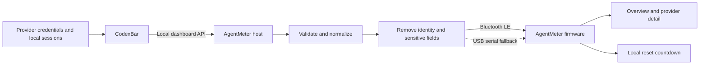

# Architecture

AgentMeter separates provider access from the physical display. The computer handles authentication and data collection; the ESP32 receives only the values required for presentation.

## Data flow

## Components

### Desktop host

The Python host application will:

1. Start or connect to CodexBar on the loopback interface.
2. Poll the versioned dashboard endpoint approximately once per minute.
3. Select configured providers and convert their data into the device schema.
4. Remove account identity, raw responses, credentials, costs, and unrelated fields.
5. Deliver the snapshot over Bluetooth LE, with USB serial available for setup and recovery.
6. Retry temporary failures and expose a concise `doctor` command for troubleshooting.

Provider collection stays behind an adapter boundary so another local source can be added without changing the firmware protocol.

### Firmware

The ESP32 firmware will:

1. Receive and validate a bounded snapshot.
2. Keep at most four providers and three windows per provider in memory.
3. Render overview, provider detail, alert, waiting, disconnected, and stale states.
4. Update reset countdowns locally once per second.
5. Dim and blank the AMOLED after configurable idle periods.
6. Reject malformed, oversized, or unsupported messages without losing the last good snapshot.

### Shared contract

`schemas/device-snapshot-v1.schema.json` is the language-independent contract. Safe fixtures under `fixtures/` let host and firmware work proceed without live provider accounts or attached hardware.

## Communication choice

Bluetooth LE is the primary transport because it avoids network provisioning and keeps the project wireless at the data layer. USB serial carries the same logical snapshot as a dependable fallback.

The first version does not expose an HTTP server on the local network and does not use a cloud relay. These alternatives create credential, discovery, and maintenance work that is unnecessary for a personal desk display.

## Privacy boundary

The display may receive:

- Provider ID and display name
- Usage percentages and provider-defined window labels
- Reset timestamps
- Short health states such as `ok`, `error`, or `unavailable`
- Display preferences and short-lived alert events

The display must never receive:

- API keys, OAuth tokens, session cookies, or bearer tokens
- Email addresses or account identifiers
- Raw provider responses or local coding-session logs
- Prompt text, generated code, file paths, or repository names

CodexBar remains bound to `127.0.0.1`. A random dashboard token is passed only to its child process and is never written to device storage.

## Reliability rules

- A snapshot is considered stale after 180 seconds unless configured otherwise.
- Missing usage is represented as unknown, never as zero.
- Unknown protocol versions are rejected explicitly.
- Bluetooth messages are capped at 4096 bytes and acknowledged after validation.
- The last valid values may remain visible while disconnected, but they are dimmed and labeled with their age.

## Initial platform scope

- Host: macOS 14 or later
- Board: Waveshare ESP32-S3-Touch-AMOLED-2.16
- Providers used for acceptance: Codex, Claude, and Gemini
- Primary transport: Bluetooth LE
- Recovery transport: USB serial

Linux is the next host target. Windows and additional display boards follow after the first hardware release is stable.

