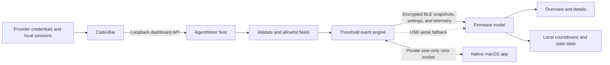

# Architecture

AgentMeter separates provider access from the physical display. The computer handles authentication and collection; the ESP32 receives only the values required for presentation.

## Data flow

## Desktop host

The Python bridge:

1. Starts `codexbar serve` on `127.0.0.1` and a temporary port.
2. Uses a newly generated 256-bit bearer token for that child process.
3. Fetches and validates dashboard schema version 1.
4. Stops the supervised server after each snapshot so provider helpers consume no memory between refreshes.
5. Isolates Claude CLI fallback in safe mode so passive collection cannot load user hooks, plugins, MCP servers, or project instructions.
6. Selects up to eight configured providers and three quota windows per provider.
7. Removes identity, credentials, raw errors, costs, credits, and unrelated fields.
8. Retains recent valid provider windows for up to one hour when a refresh returns an empty error row, marking the result stale.
9. Creates deduplicated threshold events in memory.
10. Owns the only Bluetooth connection and serializes snapshot and management operations.
11. Stores only downsampled percentages and capability-gated hardware health for 30 days.
12. Publishes state changes to the native app through a private, user-only Unix socket.
13. Runs interactively or as a macOS LaunchAgent installed into an isolated virtual environment.

Provider collection is behind an adapter boundary, so another local source can be added without changing the firmware contract.

## Firmware

The ESP32 application:

1. Advertises a private GATT service as `AgentMeter-XXXX`.
2. Requires an encrypted bonded connection for snapshot, status, management, and telemetry characteristics.
3. Queues BLE writes outside the callback, reassembles ordered fragments, and rejects incomplete, oversized, or malformed messages.
4. Parses into a fixed-size static candidate model and swaps it in only after complete validation, avoiding large allocations on the Arduino loop-task stack.
5. Filters the received providers through persistent on-device visibility settings.
6. Renders the responsive overview, settings, provider detail, rotating full view, alert, waiting, reconnecting, stale, unavailable, and provider-error states.
7. Updates countdowns and full-view rotation locally without network time or continuous host traffic.
8. Persists one revisioned settings model shared by touchscreen and desktop controls.
9. Reports only telemetry the board can measure honestly; unsupported values remain unavailable.
10. Protects the AMOLED with moderate brightness, optional dimming/screen-off, and one-pixel shifting.

The same parser accepts newline-delimited USB serial snapshots for diagnosis and recovery.

## Privacy boundary

The display may receive provider IDs and names, short status values, quota labels, usage percentages, reset timestamps, display preferences, and short-lived event IDs. It must never receive API keys, OAuth tokens, cookies, email addresses, account IDs, prompts, code, file paths, repository names, raw responses, or local coding-session logs.

CodexBar stays on loopback. Its temporary bearer token is passed through `CODEXBAR_DASHBOARD_TOKEN`, not command arguments or files. The supervised server remains alive only while collecting one snapshot and is stopped before the bridge waits for its next interval.

The desktop socket opens no TCP port and accepts only the current macOS user. Local history uses fixed columns for normalized percentages, reset times, connection codes, and supported power telemetry. It does not store identity, prompts, code, credentials, raw responses, or billing details.

## Reliability rules

- Missing usage remains unknown and is never converted to zero.
- Documents are capped at 4096 bytes.
- Frame and schema versions are checked explicitly.
- Fragments must arrive in order and complete within two seconds.
- A five-byte ACK is sent only after the JSON has been reassembled and parsed.
- The host retries a whole message up to three times and reconnects after link errors.
- Invalid data never replaces the last valid model.
- A transient provider error preserves its recent windows for at most one hour and marks them stale.
- Old values may remain visible, but the UI marks them stale and reduces opacity.
- Message IDs wrap safely from 65,535 to zero; countdown and stale calculations tolerate `millis()` rollover.

## Supported scope

- Host: macOS 14 or later
- Board: Waveshare ESP32-S3-Touch-AMOLED-2.16
- Acceptance providers: Codex, Claude, Gemini, and Cursor
- Primary transport: Bluetooth LE
- Recovery transport: USB serial

Linux, Windows, more boards, and additional data adapters remain future work.
