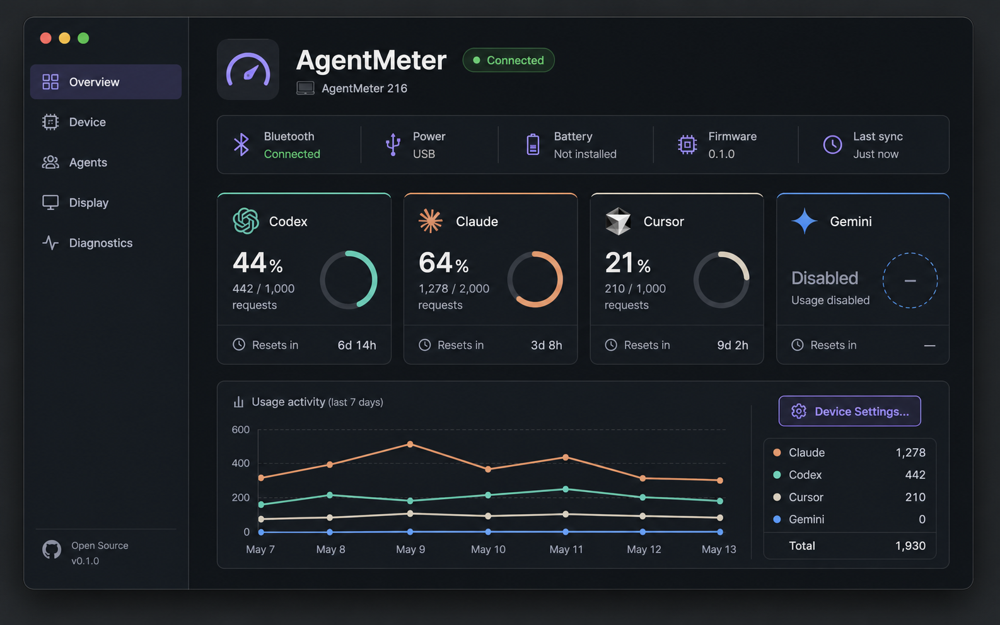
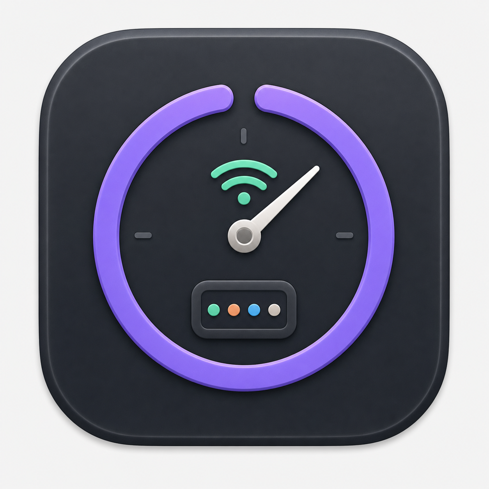
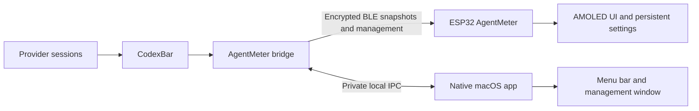

# AgentMeter macOS Companion Design

**Status:** Approved for implementation

**Date:** 2026-08-03

**Author:** Nipun Theekshana

**Target:** macOS 14 or later, one Mac and one AgentMeter device

## 1. Purpose

AgentMeter currently runs as a background Python bridge with no graphical control plane. The
bridge collects coding-agent usage through CodexBar, owns the Bluetooth Low Energy connection,
and sends display snapshots to the ESP32. Device connectivity, provider health, service state,
and on-device preferences are not visible or controllable from macOS.

The companion adds a polished native macOS application that:

- runs from the menu bar and opens a full management window;
- launches at login and keeps synchronizing after its window closes;
- manages discovery, pairing, connection, reconnection, and service health;
- shows provider usage, synchronization state, firmware information, and honest hardware
  telemetry;
- reads and updates all supported display settings without editing configuration files;
- reflects settings changed directly on the ESP32;
- remains private, local, responsive, and inexpensive to run.

The first release is macOS-only and supports one AgentMeter paired with one Mac. Firmware
installation, cloud access, Windows/Linux, and multiple simultaneous devices are not part of
this design.

## 2. Product principles

1. **One Bluetooth owner.** The background bridge remains the only process that communicates
   with the ESP32. The app controls the bridge instead of opening a competing connection.
2. **Native and lightweight.** The interface uses SwiftUI and macOS frameworks without a web
   runtime or third-party UI framework.
3. **Honest telemetry.** Unsupported or unavailable measurements are shown as unavailable. The
   product never invents battery percentage, current draw, or quota values.
4. **Device works independently.** The ESP32 is authoritative for display settings and retains
   them when the Mac is unavailable.
5. **Local by default.** Provider credentials and private coding data stay in their existing
   tools. AgentMeter adds no account, cloud service, analytics, or remote-control endpoint.
6. **Backward-compatible evolution.** Existing snapshot delivery and ACK characteristics remain
   valid while management features are added through new characteristics and capabilities.
7. **Accessible in both appearances.** Every screen supports system, light, and dark appearance,
   keyboard navigation, VoiceOver labels, and status text that does not rely on colour alone.

## 3. Visual direction

The approved application concept establishes the hierarchy and density, not literal sample
values. Production screens render the quota windows and reset times provided by AgentMeter and
do not invent request totals.



The approved icon concept combines a usage gauge, live wireless status, and the four established
provider colours. It is a direction reference. The production icon will be recreated as a clean,
vector-friendly source and exported through the macOS asset catalogue rather than using the
concept bitmap unchanged.



### 3.1 Appearance

- Default to the macOS system appearance.
- Offer **System**, **Light**, and **Dark** overrides in application preferences.
- Build colours from semantic tokens for background, grouped surface, raised surface, border,
  primary text, secondary text, status, warning, and critical states.
- Retain the AgentMeter violet accent and existing provider accents:
  - Codex mint `#52E3B2`
  - Claude peach `#F2A36B`
  - Gemini sky `#5EC8FF`
  - Cursor warm neutral `#D6D5CC`
- Pair every status colour with text and, where useful, a symbol.
- Respect Reduce Motion, Increase Contrast, and Reduce Transparency.

### 3.2 Window behaviour

- Default content size: approximately 1120 x 760 points.
- Minimum content size: approximately 900 x 620 points.
- The window is freely resizable and supports native macOS full screen.
- Use `NavigationSplitView`; collapse the sidebar at compact widths.
- Reflow overview cards from four columns to two columns and then one column when needed.
- Use scrolling before compressing labels, controls, or touch targets below usable sizes.
- Restore window frame, sidebar visibility, and selected section between launches.
- Closing the main window leaves the menu-bar app and bridge running. Explicit **Quit
  AgentMeter** stops the app and its managed bridge.

## 4. User experience

### 4.1 First run

The first-run assistant performs five bounded steps:

1. Verify or install the bundled bridge.
2. Check Bluetooth permission and adapter availability.
3. Discover and select one nearby `AgentMeter-XXXX` peripheral.
4. Establish the encrypted bond and read device capabilities and settings.
5. Complete the first provider refresh and display synchronization.

Each step provides a retry action and a plain-language explanation. A user may open diagnostics
without completing pairing.

### 4.2 Menu bar

`MenuBarExtra` remains available while the main window is closed. Its symbol communicates four
top-level states: connected, connecting, attention needed, and stopped.

The menu contains:

- device name and connection state;
- last successful device synchronization;
- a compact summary of enabled provider usage;
- **Open AgentMeter**;
- **Reconnect** or **Disconnect**, depending on state;
- **Refresh Usage**;
- **Launch at Login**;
- **Quit AgentMeter**.

The menu does not render charts or run a separate refresh loop.

### 4.3 Main sections

#### Overview

- Connection, power source, battery state, firmware version, and last synchronization.
- Provider cards using real quota percentages, status, reset countdowns, and stale age.
- A bounded local trend chart using downsampled percentages only when enough samples exist.
- Current warnings and a direct **Device Settings** action.

#### Device

- Selected device, Bluetooth adapter state, connection state, signal quality, and last contact.
- **Connect**, **Disconnect**, **Reconnect**, **Identify**, and **Forget Device** actions.
- Firmware and management-protocol versions.
- Power source, USB state, battery presence, charging, voltage, and supported board telemetry.
- Device uptime and capability-gated diagnostic information.

macOS does not expose a universal programmatic removal operation for every CoreBluetooth bond.
**Forget Device** clears the app selection and asks the connected ESP32 to clear its saved host
bond. If macOS retains a system record, the app directs the user to Bluetooth Settings.

#### Agents

- Provider collection status and last successful collection time.
- Visible/hidden state and display order for Codex, Claude, Gemini, Cursor, and future providers.
- Clear unavailable and stale explanations.
- Manual refresh and a link to the existing provider setup location when authentication needs
  attention.

Provider credentials are never requested or stored by AgentMeter. Provider collection selection
is host-owned; visibility and ordering on the display are device-owned.

#### Display

- Agent visibility and ordering.
- Always-on mode.
- Full-view mode and rotation interval.
- Capability-dependent brightness, dim delay, screen-off delay, alert thresholds, and sound.
- A read-only preview of the resulting layout.

Unsupported settings remain hidden or disabled with a reason. Changes show one of three states:
**Saving**, **Synced**, or **Waiting for device**.

#### Diagnostics

- App, bridge, firmware, snapshot-schema, IPC, and management-protocol versions.
- Bridge lifecycle and provider dependency health.
- Sanitized, bounded recent events.
- **Restart Bridge**, **Refresh Device State**, and **Copy Diagnostics** actions.

Diagnostics never include prompts, source code, file paths from coding sessions, cookies, tokens,
account identity, or unredacted upstream responses.

## 5. System architecture



### 5.1 Native application

The macOS client is a SwiftUI application targeting macOS 14 or later. It uses:

- SwiftUI for window, navigation, forms, and menu bar;
- Swift Charts for bounded local trends;
- Observation for application state;
- Network framework for the Unix-domain socket;
- ServiceManagement for launch-at-login and the bundled bridge;
- OSLog for private, structured application diagnostics.

The application contains no provider collector and no CoreBluetooth connection. It presents the
bridge state and sends typed commands over IPC.

Suggested source boundary:

```text
desktop/
├── Package.swift
├── Sources/
│   ├── AgentMeterApp/
│   ├── AgentMeterCore/
│   └── AgentMeterIPC/
├── Resources/Assets.xcassets/
├── Tests/
│   ├── AgentMeterCoreTests/
│   ├── AgentMeterIPCTests/
│   └── AgentMeterSnapshotTests/
└── scripts/package-app.sh
```

Core models and IPC types stay independent from SwiftUI so they can be exhaustively unit tested.

### 5.2 Background bridge

The existing Python bridge retains responsibility for:

- CodexBar lifecycle and provider normalization;
- last-good provider caching and privacy filtering;
- the sole BLE connection and snapshot delivery;
- device discovery and connection state;
- management commands, device settings, and telemetry;
- bounded local history and sanitized events;
- the local IPC server.

For release builds, the Python runtime and dependencies are packaged as a signed, self-contained
helper inside `AgentMeter.app`; the user does not install Python. Use a one-folder bundle rather
than a self-extracting one-file executable to avoid launch-time CPU, disk churn, and temporary
copies. Development continues to support the existing virtual-environment workflow.

The app registers the bundled helper with ServiceManagement. Migration detects
`com.prabhavalabs.agentmeter`, stops and removes the legacy user LaunchAgent only after the new
helper is ready, and preserves configuration and diagnostic history. The migration is idempotent
and never leaves two bridge processes running.

### 5.3 Local IPC

The bridge creates a Unix-domain socket inside a per-user runtime directory with directory mode
`0700` and socket mode `0600`. It validates the connecting peer user on macOS. No TCP port is
opened.

Messages are newline-delimited UTF-8 JSON with:

- IPC schema version;
- request or event ID;
- message type;
- payload;
- success result or structured error.

The server rejects lines larger than 64 KiB, malformed JSON, unsupported versions, unknown
commands, and clients owned by another user. Commands include:

- `status.get`
- `device.scan`, `device.connect`, `device.disconnect`, `device.forget`
- `device.identify`, `device.refresh`
- `settings.get`, `settings.patch`
- `providers.refresh`
- `history.query`
- `diagnostics.get`
- `bridge.restart`

After a version handshake, the app subscribes to events rather than polling. Event groups are:

- connection state;
- bridge state;
- provider snapshot and collection health;
- device information and telemetry;
- settings state and write result;
- synchronization result;
- sanitized diagnostic event.

## 6. Bluetooth management protocol

### 6.1 Compatibility

The existing service, snapshot characteristic, five-byte delivery ACK, fragmentation rules, and
USB recovery transport remain unchanged. Two encrypted characteristics are added to the same
service:

| Purpose | UUID suffix | Properties |
| --- | --- | --- |
| Management request | `0004` | Encrypted write with response |
| Device state/event | `0005` | Encrypted read and notify |

The full UUIDs retain the existing AgentMeter base UUID. Management uses the existing bounded
fragment header with new message types. Old hosts ignore the new characteristics; a new host sees
missing characteristics as a legacy-device capability state and continues snapshot delivery.

### 6.2 Envelope

Management payloads remain compact JSON to reuse ArduinoJson, current validation patterns, test
fixtures, and contributor knowledge.

```json
{
  "schemaVersion": 1,
  "requestId": 17,
  "type": "settings.patch",
  "payload": {
    "baseRevision": 8,
    "alwaysOn": true
  }
}
```

Every request receives a correlated success or error response. Device-originated changes use an
event envelope and monotonically increasing settings revision. Payload size, field lengths,
enums, and numeric bounds are enforced before data reaches the active model.

### 6.3 Information and telemetry

The device-information state includes:

- stable model identifier;
- human-readable device name;
- firmware semantic version;
- hardware revision when known;
- snapshot and management schema versions;
- capability flags.

Telemetry may include:

- uptime;
- USB present and power source;
- battery present, charging state, voltage, and percentage;
- display on/dimmed state and active brightness;
- board temperature and free heap for diagnostics;
- measured input voltage or current only when the board API provides a trustworthy value.

Every optional value is nullable and guarded by a capability. For the normal USB-only build, the
expected state is **Power: USB** and **Battery: Not installed**.

Power-source and settings changes notify immediately. Slowly changing telemetry uses a
conservative interval and change threshold. RSSI is measured by the Mac and is not represented as
device-measured telemetry.

### 6.4 Settings model and migration

The unified device settings state contains:

- visible provider IDs and order;
- always-on mode;
- full-view mode;
- rotation interval;
- brightness, dim delay, and screen-off delay when supported;
- alert thresholds and sound when supported.

Current firmware stores visibility, always-on, full-view, and rotation separately, while snapshot
v1 carries other display defaults. Management-capable firmware migrates these into one versioned
settings blob with validation and checksum. Once the device advertises the management-settings
capability, incoming snapshots no longer overwrite managed display settings. The host continues
the legacy snapshot behaviour for older firmware.

Writes use a revision precondition:

1. The app sends a patch with the last confirmed device revision.
2. Firmware validates the complete resulting settings model.
3. Firmware stores it atomically, increments the revision, applies it, and returns the complete
   confirmed state.
4. A touchscreen change follows the same persistence path and notifies the host.

The bridge may queue an offline patch with its base revision. If the device revision changed in
the meantime, firmware rejects the stale patch. The device state wins; the app explains the
conflict and offers to reapply the user's pending value. No wall-clock conflict resolution is
used.

NVS writes are debounced and occur only after an actual setting change to limit flash wear.

## 7. State and data ownership

| State | Authority | Persistence |
| --- | --- | --- |
| Provider authentication | CodexBar/provider tools | Existing tool storage |
| Provider collection selection and interval | Bridge | AgentMeter host configuration |
| Current provider usage | Provider source via bridge | Memory plus bounded last-good cache |
| Device display settings | ESP32 | Versioned NVS settings blob |
| Pending offline device change | Bridge | Small local pending-command store |
| Theme, window, notifications, launch at login | macOS app | UserDefaults/ServiceManagement |
| Usage trends and connection events | Bridge | Bounded SQLite database |

History stores only normalized percentages, reset timestamps, provider IDs, device-health values,
and connection events. It downsamples to at most one sample per provider/window every five minutes
and prunes records older than 30 days. History can be cleared from the app.

## 8. Connection lifecycle

The bridge exposes these explicit states:

```text
stopped -> bluetoothUnavailable -> searching -> connecting
        -> authenticating -> synchronizing -> connected
        -> degraded -> retrying -> searching
```

- Unexpected failures use bounded exponential backoff with jitter, capped at 60 seconds.
- Manual reconnect bypasses the active delay.
- Mac sleep pauses retries; wake triggers adapter and connection re-evaluation.
- Bluetooth disabled, permission denied, device unavailable, authentication failed, protocol
  incompatible, snapshot rejected, and provider collection failed are distinct errors.
- The last valid usage stays visible during a short interruption and is marked with its age.
- The UI never converts missing values to zero or shows an unconfirmed setting as synced.
- launchd/ServiceManagement restarts an unexpectedly terminated bridge with throttling.

## 9. Performance and resource constraints

- One bridge process, one CodexBar collection process at a time, and one BLE connection.
- No app or IPC polling loop; use events and state coalescing.
- No high-frequency menu-bar timers. Countdown presentation updates at the minimum useful rate.
- Do not render hidden windows or charts while the window is closed.
- Downsample and prune telemetry/history before persistence.
- Bound IPC frames, BLE payloads, pending commands, history, event buffers, and logs.
- Suppress provider child output and retain the existing Claude safe-mode probe.
- Preserve the current collect-then-exit CodexBar lifecycle so provider processes do not remain
  resident between refreshes.
- Target negligible idle CPU and **Low** Energy Impact in Activity Monitor. Establish measured
  baselines before release instead of claiming fixed memory values across macOS versions.
- Run an eight-hour menu-only soak and a repeated open/close/reconnect test without monotonic
  process, memory, file-descriptor, or child-process growth.

## 10. Security and privacy

- Require BLE Secure Connections bonding and encrypted access for all existing and new
  characteristics.
- Accept management commands only on an authenticated connection.
- Keep the IPC socket local to the signed-in user and validate peer ownership.
- Do not create a localhost HTTP server for app control.
- Keep CodexBar on loopback with its temporary bearer token in the child environment.
- Never persist provider credentials, cookies, prompts, code, account identity, raw provider
  responses, or billing details in the app, history, logs, device, or fixtures.
- Use OSLog privacy annotations and bounded rotating helper logs.
- Require confirmation for destructive actions such as forgetting a device, clearing history,
  restarting the ESP32, or resetting configuration.
- Sign the app and bundled helper together, enable Hardened Runtime, include an accurate Bluetooth
  usage description, and notarize release artifacts.
- Add no analytics SDK, crash-reporting upload, cloud account, or automatic diagnostics upload.

## 11. Error presentation

Errors use a stable category, plain-language summary, optional recovery action, and private
diagnostic detail. Expected recoveries include:

- Open System Settings for denied Bluetooth permission.
- Turn Bluetooth on.
- Bring the device nearby or connect USB power.
- Retry pairing after clearing the device bond with the physical control.
- Open provider setup when CodexBar reports authentication unavailable.
- Restart the bridge after a local service failure.
- Update the app or firmware when management protocol versions are incompatible.

Transient provider failures do not mark the Bluetooth connection unhealthy. Likewise, a healthy
provider refresh does not hide a degraded device connection.

## 12. Verification strategy

### 12.1 Swift

- Unit tests for state reducers, connection-state presentation, appearance preference, settings
  patches, capability gating, error mapping, and history formatting.
- IPC codec and Unix-socket integration tests using a deterministic fake bridge.
- View-model tests with no live Bluetooth or provider account.
- Snapshot tests for light/dark, increased contrast, one through four providers, unavailable and
  stale states, narrow/default/wide sizes, and full screen.
- Accessibility audit for labels, keyboard traversal, focus order, and non-colour status.

### 12.2 Python bridge

- Unit tests for IPC validation, permissions, subscriptions, command correlation, bounded queues,
  history pruning, telemetry normalization, and settings conflict handling.
- State-machine tests covering adapter loss, sleep/wake, connection timeout, authentication
  failure, incompatible firmware, retry backoff, manual reconnect, and bridge restart.
- Existing provider privacy and Claude process-isolation tests remain mandatory.

### 12.3 Firmware

- Native tests for management framing, envelopes, bounds, error responses, capability state,
  settings migration, revision conflicts, checksum failure, and NVS write coalescing.
- ESP32 builds verify Arduino, NimBLE, LVGL, PMIC, and display-driver integration.
- Invalid or incomplete management messages must never replace settings or telemetry state.

### 12.4 Hardware and release acceptance

- Fresh pair on a clean macOS user account.
- Automatic reconnect after device restart, Mac sleep/wake, Bluetooth toggle, and temporary range
  loss.
- Bidirectional settings changes from app and touchscreen.
- USB-only telemetry reports no battery; battery telemetry is tested only with approved hardware.
- Window close leaves synchronization active; explicit quit stops managed processes.
- Legacy LaunchAgent migration leaves exactly one bridge.
- Light/dark/system appearance, resizing, compact sidebar, and native full screen.
- Eight-hour resource soak and repeated connection cycle.
- Signed/notarized app installation on a Mac without Python or the source repository.

## 13. Delivery phases

1. **Protocol foundation:** management schema, fixtures, firmware information, telemetry,
   settings migration, commands, and native tests.
2. **Bridge control plane:** BLE management client, connection state machine, settings queue,
   history, IPC server, and Python tests.
3. **Native shell:** Swift package, typed IPC client, app state, menu bar, Overview, appearance,
   and fake-bridge development mode.
4. **Management interface:** Device, Agents, Display, Diagnostics, pairing, settings sync,
   responsive layouts, full screen, and accessibility.
5. **Distribution:** production icon source and asset catalogue, bundled self-contained helper,
   ServiceManagement migration, signing/notarization scripts, and clean-install verification.
6. **Documentation and stabilization:** setup, usage, architecture, protocol, privacy,
   troubleshooting, contributor workflow, hardware acceptance, and performance soak results.

Each phase must leave host and firmware tests green. The management protocol and fake bridge allow
desktop development without connected hardware, but the feature is not complete until the final
hardware and clean-install acceptance suite passes.

## 14. Explicit non-goals for v1

- Installing or updating ESP32 firmware through the app.
- Managing more than one AgentMeter at a time.
- Pairing one AgentMeter with multiple active Macs.
- Windows, Linux, iOS, or web clients.
- Wi-Fi control, cloud relay, remote access, accounts, or analytics.
- Replacing CodexBar provider authentication.
- Displaying fabricated token totals, battery percentage, or power consumption.
- Automatic upload of logs or diagnostics.

## 15. Completion criteria

The macOS companion is complete only when:

- it installs and launches on a clean supported Mac without requiring Python;
- it runs from the menu bar, launches at login when enabled, and continues after window close;
- it is the visible control plane for exactly one background bridge and BLE connection;
- it discovers, pairs, reconnects, disconnects, and forgets the supported ESP32 safely;
- it shows provider, connection, synchronization, firmware, power, and supported telemetry state;
- every supported on-device setting can be read and changed from the app, and touchscreen changes
  return to the app;
- all screens work in system, light, and dark appearance at supported window sizes and full screen;
- privacy, protocol, unit, integration, hardware, performance, packaging, signing, and clean-install
  gates pass;
- documentation covers installation, setup, normal use, troubleshooting, architecture, privacy,
  and contribution.
