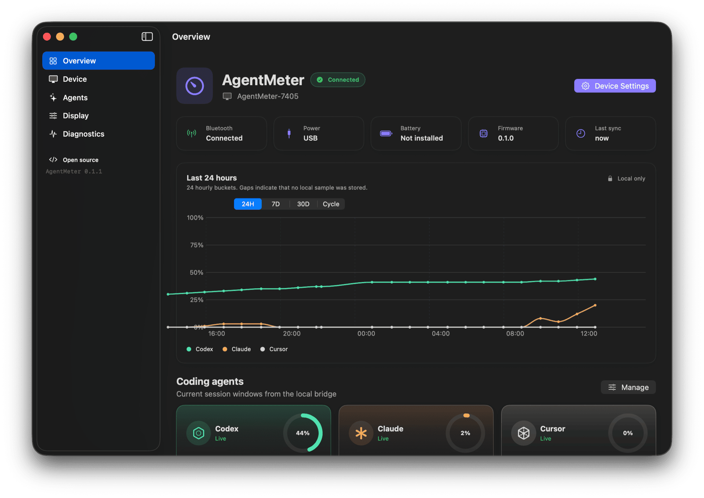
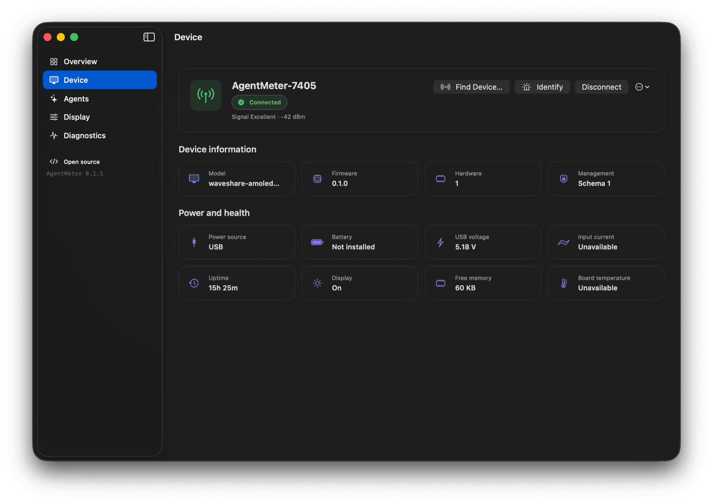
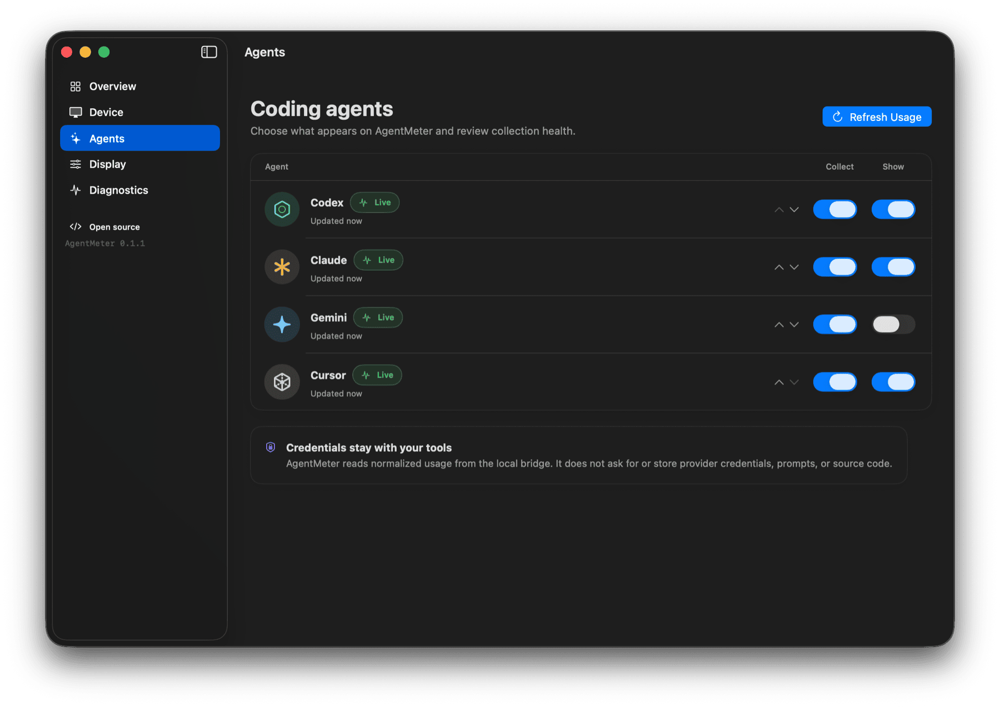
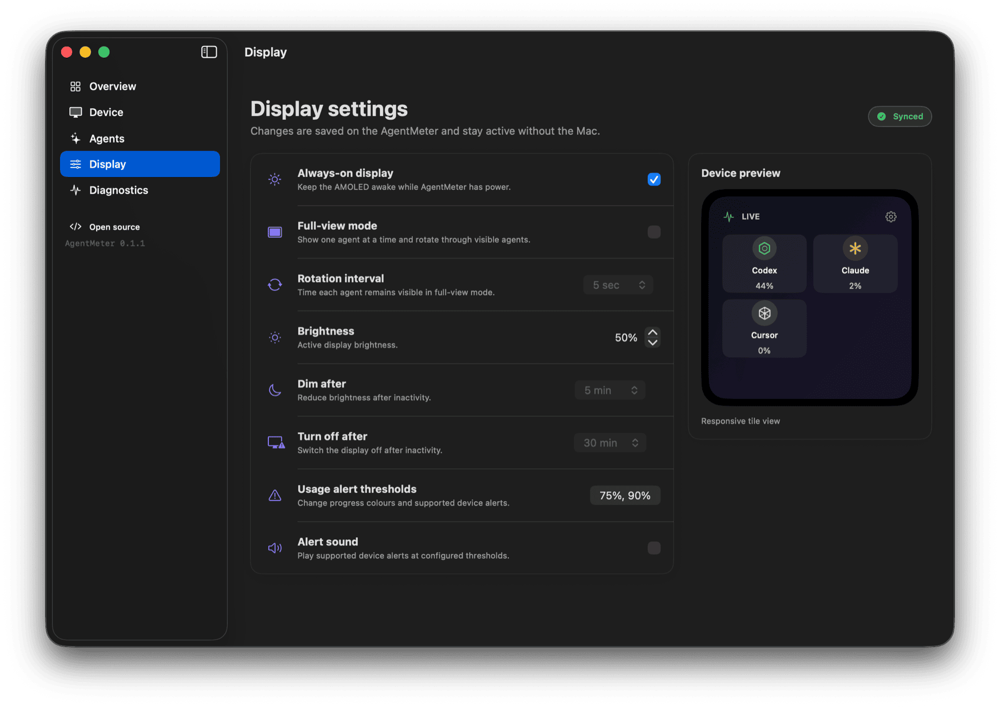
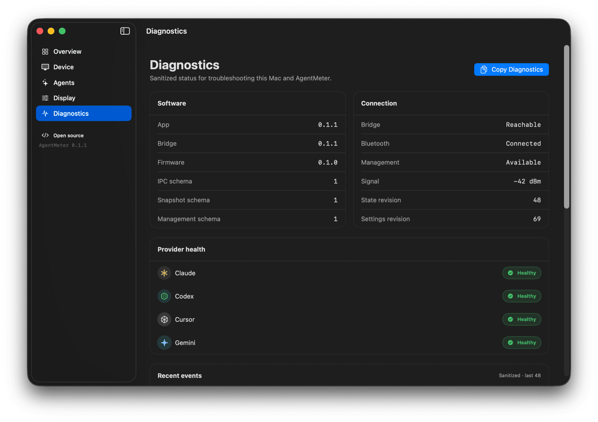
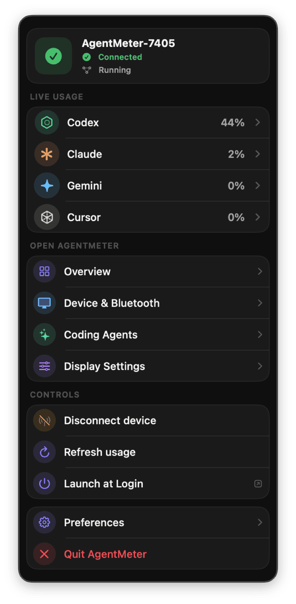
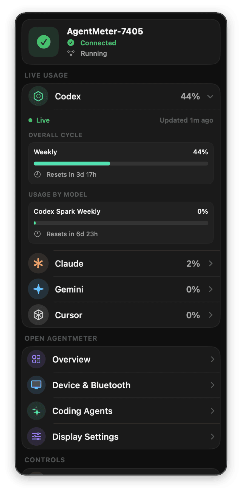

# macOS companion app

AgentMeter includes a native SwiftUI companion for macOS 14 or later. It keeps one small menu-bar
status item available while the main window is closed and controls one bundled bridge over a
private Unix socket. Release builds are self-contained and do not require Python, the source
repository, or Xcode. The app never opens a competing Bluetooth connection.



## What the app manages

- Bridge and ESP32 connection status, discovery, reconnect, disconnect, identify, and forget
- USB power, battery presence, supported voltage, display state, uptime, and device memory
- Codex, Claude, Gemini, Cursor, and future provider health and current usage windows
- Agent visibility and display order
- Always-on mode, full-view rotation, rotation interval, brightness, dimming, and screen-off time
- Firmware and protocol information, bounded history controls, and sanitized diagnostics
- Local usage trends for the last 24 hours, 7 days, 30 days, and the current usage cycle
- First-run setup, sleep/wake recovery, and optional notifications

Firmware installation and updates are intentionally outside the app. Unsupported measurements remain **Unavailable** rather than being estimated.

## Main-window tour

<table>
  <tr>
    <td width="50%"></td>
    <td width="50%"></td>
  </tr>
  <tr>
    <td align="center"><strong>Device</strong><br>Discover, reconnect, identify, forget, and inspect supported telemetry</td>
    <td align="center"><strong>Agents</strong><br>Review collection health and choose what appears on the display</td>
  </tr>
  <tr>
    <td width="50%"></td>
    <td width="50%"></td>
  </tr>
  <tr>
    <td align="center"><strong>Display</strong><br>Control brightness, sleep, rotation, alerts, and preview the layout</td>
    <td align="center"><strong>Diagnostics</strong><br>Inspect sanitized health data and recent operational events</td>
  </tr>
</table>

## Window and appearance

The default window is 1120 × 760 points with a 900 × 620 point content minimum. It can be resized freely above that minimum and supports the normal macOS full-screen control. Adaptive grids reflow before labels or controls are compressed, and long pages scroll.

Choose **AgentMeter → Settings** to select:

- **System** — follows the macOS appearance
- **Light** — always uses the light interface
- **Dark** — always uses the dark interface

The same preference applies to the main window, menu-bar panel, and settings window. Statuses pair colour with text and symbols.

## Menu-bar panel

The menu-bar panel remains available while the main window is closed. It shows the bridge and
device state, current agent percentages, navigation shortcuts, connection controls, login-item
status, preferences, and the explicit quit action. Clicking an agent expands its current session,
overall cycle, and model-specific windows when those values are reported.

<table>
  <tr>
    <td width="50%"></td>
    <td width="50%"></td>
  </tr>
  <tr>
    <td align="center"><strong>Compact panel</strong></td>
    <td align="center"><strong>Expanded provider</strong></td>
  </tr>
</table>

Closing the main window hides its Dock icon; it does not stop collection or Bluetooth. Choose
**Quit AgentMeter** in this panel to stop both the app and its bundled bridge intentionally.

## Local usage history

The Overview chart keeps usage history on the Mac and never uploads it. Choose the range that best
matches what you want to inspect:

- **24H** shows up to 24 hourly points.
- **7D** shows up to seven daily points.
- **30D** shows up to 30 daily points.
- **Cycle** starts at the latest observed usage reset and adapts the number of points to the
  available cycle history.

Missing samples remain gaps rather than being presented as zero usage. Provider details separate
the current session from the overall cycle and show the reset time for each window. Model-specific
rows are included when the local provider source reports them. If a provider names a model window
without reporting its percentage, AgentMeter displays **Not reported** instead of inventing a zero
value.

## Desktop widgets

The managed app provides two WidgetKit choices. **AgentMeter Dashboard** shows several providers;
**AgentMeter Focus** shows one provider with selectable outer and inner allowance windows. Both
support the small, medium, large, and extra-large macOS families. Provider capacity is two in
small, four in medium, five in large, and eight in extra-large. Weekly, monthly, or billing-cycle
allowances are preferred as the primary outer value, while session, daily, and other shorter
windows remain visible as the inner or additional values.

Edit a widget to configure its providers, selected Focus windows, **Used** or **Remaining**
percentage, 7- or 30-day history, layout, compact or comfortable density, theme, reset countdown
or absolute date, optional status and freshness, and whether a click opens Overview, Agents, or a
provider detail. Every widget instance stores its own configuration, so a Dashboard and multiple
Focus widgets can make independent choices.

Small and medium families omit history so allowance and reset values stay readable. Large and
extra-large families can show a heat map or trend:

- A heat map measures percentage points consumed during each local calendar day. Combined scope
  averages available provider values; single-provider scope uses only the selected provider.
- A trend shows the latest used percentage recorded on each day for the selected outer, inner, or
  specific Focus window. Switching the rings to **Remaining** does not invert historical facts;
  history continues to describe allowance consumption.
- Missing days are gaps, not zeroes. The 7-day and 30-day ranges follow local calendar boundaries,
  including daylight-saving changes.

If a reset timestamp has passed but no fresh provider sample has established the next window, the
widget says **Refresh pending**. It does not infer a zero or roll the old value into a new cycle.
Widget timelines continue updating while the main window is closed because the menu-bar app and
bridge remain active.

The app writes one bounded JSON snapshot to
`group.com.prabhavalabs.agentmeter.shared`; the extension reads that file directly. The snapshot
contains only provider IDs and display names, health status, percentages, reset and update times,
and downsampled daily history. It contains no account identity, prompt, code, repository or file
path, API token, cookie, credential, raw response, local session log, cost, credit, or billing
field. The extension has no IPC, Bluetooth, SQLite, network, or keychain dependency.

The first widget release is managed-only because Apple requires the app and extension to carry
matching App Group entitlements and compatible provisioning profiles. The community DMG remains
app-only and has no `Contents/PlugIns` directory or App Group dependency.

## Install a release

The public community DMG is ad-hoc signed and is not notarized by Apple. That means macOS cannot
identify Prabhava Labs as a verified developer even though the release checksum and code structure
can be verified. Download both the DMG and its `.sha256` file from the same GitHub release, then
verify it before installation:

```bash
shasum -a 256 -c AgentMeter-0.1.2-macOS-arm64-community.dmg.sha256
```

Open the DMG, drag AgentMeter to **Applications**, then Control-click AgentMeter and choose
**Open**. Confirm **Open** in the security dialog. Use this exception only for a release downloaded
from the project's official GitHub repository with a matching checksum.

The community build runs its bundled bridge while AgentMeter is open. Closing the main window
keeps the menu-bar app and bridge active; choosing **Quit AgentMeter** stops both. A future
Developer ID build can instead register the bridge as an independently managed login item. To
start the community build automatically, add AgentMeter under **System Settings → General → Login
Items**; the app provides a shortcut to that page.

For a Developer ID signed and notarized build, move the app to `/Applications` and open it normally:

```bash
ditto AgentMeter.app /Applications/AgentMeter.app
open /Applications/AgentMeter.app
```

The first-run assistant prepares the private configuration, requests Bluetooth access only when
you scan, connects to the selected display, verifies encrypted management, and loads provider
usage. The embedded helper remains available when the main window is closed.

If the older `com.prabhavalabs.agentmeter` LaunchAgent is present, the app copies its configuration,
registers the bundled bridge, stops the older process, and archives the legacy plist under
`~/Library/Application Support/AgentMeter/Migration`. History remains in place. Migration is
idempotent and never intentionally runs two Bluetooth bridges after setup completes.

## Build for local development

Install the development and packaging dependencies. The normal package target creates the
app-only community build:

```bash
make setup
make desktop-app
ditto desktop/dist/AgentMeter.app /Applications/AgentMeter.app
open /Applications/AgentMeter.app
```

The bundle is written to `desktop/dist/AgentMeter.app` with an ad-hoc signature suitable for build
and interface checks. It has no widget and macOS does not authorize its embedded background item.
Use the synthetic bridge workflow below for ad-hoc UI development. For an unsigned Xcode build
that compiles and embeds the WidgetKit extension, run:

```bash
make desktop-widget-build
make desktop-widget-verify
```

The verifier inspects
`desktop/.build/xcode-derived/Build/Products/Debug/AgentMeter.app`. An unsigned build proves bundle
structure only; gallery presence and App Group sharing require real signing.

**Launch AgentMeter at login** controls whether the graphical app and menu item open after sign-in.
The bundled bridge is a separate lightweight background item because it maintains collection and
Bluetooth synchronization while the window is closed. **Quit AgentMeter** stops both intentionally.

## Development with synthetic data

Run the deterministic fake bridge from [Development](development.md), then start the Swift executable with `AGENTMETER_IPC_PATH` set to its socket. Available scenarios cover connected USB power, disconnected, pairing, provider unavailable, legacy firmware, and a settings revision conflict.

```bash
swift test --package-path desktop
swift build --package-path desktop
```

No device, provider account, credentials, or Bluetooth permission is required for these tests.

## Packaging and signing

`desktop/scripts/package-app.sh` has two explicit paths. Community mode performs the existing
SwiftPM/manual assembly and produces an ad-hoc, app-only bundle. Managed mode builds the Release
Xcode scheme, copies that signed app into `desktop/dist` without mutating the Xcode build product,
adds the signed PyInstaller bridge and release resources, preserves the extension signature, and
then signs only the outer app with `desktop/Resources/AgentMeter.entitlements`. It never uses
`codesign --deep` to repair nested code.

Managed mode requires a real team, signing identity, and the UUIDs of two installed provisioning
profiles. Both profiles must grant `group.com.prabhavalabs.agentmeter.shared` and target their
exact bundle IDs. Before building, the script privately decodes the two installed profiles and
validates their UUID, team, bundle ID, and App Group, removing decoded metadata on exit or signal.
Manual target settings feed the app UUID only to the app and the widget UUID only to the extension;
the script does not permit Xcode portal updates and rejects any different embedded profile. The
same version and build number are expanded into both Info.plists and checked before copying and
final signing. App and extension signatures and entitlements are then inspected separately:

```bash
AGENTMETER_DISTRIBUTION_MODE=managed \
AGENTMETER_DEVELOPMENT_TEAM="TEAMID" \
AGENTMETER_APP_PROVISIONING_PROFILE="11111111-1111-1111-1111-111111111111" \
AGENTMETER_WIDGET_PROVISIONING_PROFILE="22222222-2222-2222-2222-222222222222" \
CODE_SIGN_IDENTITY="Apple Development: Your Name (TEAMID)" \
  desktop/scripts/package-app.sh
```

Distribution credentials, notarization submission, and stapling are release-owner operations. A
managed distribution must use profiles and an identity appropriate for that release channel. The
ad-hoc community package runs the bridge as a child of the menu-bar application instead of
attempting to authorize the managed background service.

Build and verify the community DMG without an Apple Developer account:

```bash
make desktop-community-dmg
```

This writes an architecture-labelled DMG and matching SHA-256 file under `desktop/dist`. The
verification step checks the checksum, disk image, ad-hoc code signatures, bundle version,
distribution mode, bundled bridge version, and expected Gatekeeper rejection.

After packaging with a Developer ID Application identity, notarize and create the release archive:

```bash
NOTARY_KEYCHAIN_PROFILE="AgentMeter Notary" desktop/scripts/notarize-app.sh
```

The keychain profile must already have been created with `xcrun notarytool store-credentials`.
The script submits a temporary archive, staples and validates the app, verifies Gatekeeper, and
writes the distributable zip to `desktop/dist`.

### Signed widget acceptance

The automated unsigned build cannot substitute for this release-owner check. With a real
development team and matching app/widget App Group profiles:

1. Build managed mode, run `desktop/scripts/verify-widget-bundle.sh desktop/dist/AgentMeter.app`,
   and inspect app and extension independently with `codesign -dvvv --entitlements :-`.
2. Install the app and confirm Dashboard and Focus appear in the widget gallery.
3. Add independent instances and exercise small, medium, large, and extra-large families.
4. Verify used and remaining values, 7/30-day heat maps and trends, density, every theme, window
   selections, and Overview, Agents, and provider-detail deep links.
5. Close the main window and confirm widget data continues updating.
6. Interrupt and restore the bridge, confirming honest stale/unavailable recovery.
7. Use the reset-boundary synthetic fixture and confirm a passed reset says **Refresh pending**
   until fresh provider data arrives.

Do not report this checklist as passed without the actual team, profiles, installed widget gallery,
and runtime observations.

## Troubleshooting

- **Bridge unavailable:** open **AgentMeter → Settings**. If approval is required, allow AgentMeter under **System Settings → General → Login Items & Extensions**, then choose **Try Again**.
- **Device disconnected:** open **Device**, scan, and select the nearby `AgentMeter-XXXX`. This is different from bridge availability.
- **Provider unavailable:** verify the provider in CodexBar, then refresh usage. The last valid value may appear as stale during a transient failure.
- **Launch at login fails:** move the signed app to `/Applications`, reopen it, and retry. macOS also lists it under **System Settings → General → Login Items & Extensions**.
- **Settings waiting for device:** reconnect the ESP32. Device-side settings remain authoritative and are never overwritten silently after a revision conflict.
