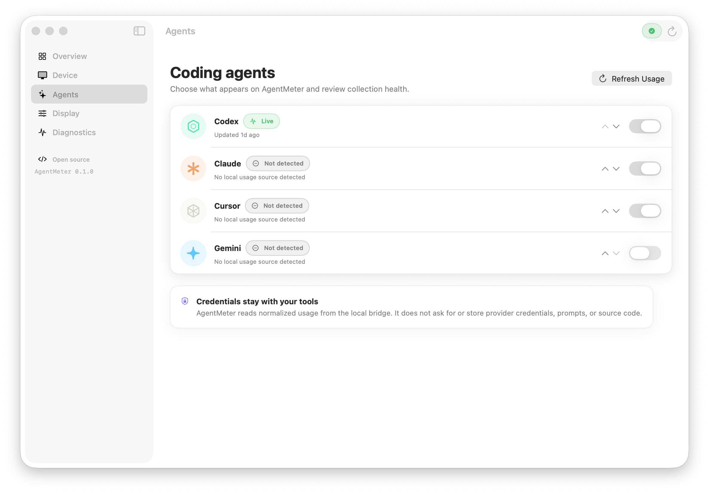

# macOS companion app

AgentMeter includes a native SwiftUI companion for macOS 14 or later. It keeps one small menu-bar status item available while the main window is closed and controls the existing background bridge over a private Unix socket. The app never opens a competing Bluetooth connection and never runs provider tools itself.



## What the app manages

- Bridge and ESP32 connection status, discovery, reconnect, disconnect, identify, and forget
- USB power, battery presence, supported voltage, display state, uptime, and device memory
- Codex, Claude, Gemini, Cursor, and future provider health and current usage windows
- Agent visibility and display order
- Always-on mode, full-view rotation, rotation interval, brightness, dimming, and screen-off time
- Firmware and protocol information, bounded history controls, and sanitized diagnostics

Firmware installation and updates are intentionally outside the app. Unsupported measurements remain **Unavailable** rather than being estimated.

## Window and appearance

The default window is 1120 × 760 points with a 900 × 620 point content minimum. It can be resized freely above that minimum and supports the normal macOS full-screen control. Adaptive grids reflow before labels or controls are compressed, and long pages scroll.

Choose **AgentMeter → Settings** to select:

- **System** — follows the macOS appearance
- **Light** — always uses the light interface
- **Dark** — always uses the dark interface

The same preference applies to the main window, menu-bar panel, and settings window. Statuses pair colour with text and symbols.

## Install for local use

Install and verify the bridge first:

```bash
make setup
.venv/bin/agentmeter service install --source .
.venv/bin/agentmeter service status
```

Build the app:

```bash
make desktop-app
open desktop/dist/AgentMeter.app
```

The local bundle is written to `desktop/dist/AgentMeter.app`, ad-hoc signed with hardened runtime, and validated before the script succeeds. Copy it to `/Applications` for a stable location:

```bash
ditto desktop/dist/AgentMeter.app /Applications/AgentMeter.app
open /Applications/AgentMeter.app
```

You can then enable **Launch AgentMeter at login** from the app settings. The app registration and the bridge LaunchAgent are separate: the app presents status and controls; the bridge continues lightweight data collection and Bluetooth synchronization.

## Development with synthetic data

Run the deterministic fake bridge from [Development](development.md), then start the Swift executable with `AGENTMETER_IPC_PATH` set to its socket. Available scenarios cover connected USB power, disconnected, pairing, provider unavailable, legacy firmware, and a settings revision conflict.

```bash
swift test --package-path desktop
swift build --package-path desktop
```

No device, provider account, credentials, or Bluetooth permission is required for these tests.

## Packaging and signing

`desktop/scripts/package-app.sh` performs a release Swift build, creates every required `.icns` size from the 1024-pixel source, assembles the bundle, signs it, and validates its code signature and property list.

For a Developer ID build, provide the identity:

```bash
CODE_SIGN_IDENTITY="Developer ID Application: Your Name (TEAMID)" \
  desktop/scripts/package-app.sh
```

Developer ID credentials, notarization submission, and stapling are release-owner operations. The local ad-hoc signature is sufficient for development on the same Mac but is not a public distribution signature.

## Troubleshooting

- **Bridge unavailable:** run `.venv/bin/agentmeter service status`. Reinstall from the current clone if the desktop socket is unavailable.
- **Device disconnected:** open **Device**, scan, and select the nearby `AgentMeter-XXXX`. This is different from bridge availability.
- **Provider unavailable:** verify the provider in CodexBar, then refresh usage. The last valid value may appear as stale during a transient failure.
- **Launch at login fails:** move the app to `/Applications`, reopen it, and retry. macOS also lists it under **System Settings → General → Login Items**.
- **Settings waiting for device:** reconnect the ESP32. Device-side settings remain authoritative and are never overwritten silently after a revision conflict.
