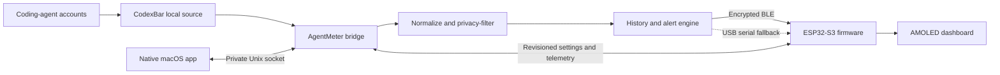

# AgentMeter project tour

AgentMeter turns coding-agent quota data into a quiet, glanceable desk display. A native macOS
companion collects normalized usage from local tools, keeps the Bluetooth connection healthy, and
lets the user manage the display without editing configuration files.

<p align="center">
  
</p>

<p align="center"><em>The working ESP32-S3 prototype, powered over USB and receiving live usage over Bluetooth LE.</em></p>

## At a glance

| Area | Current implementation |
| --- | --- |
| Display | 2.16-inch 480×480 AMOLED touchscreen |
| Controller | ESP32-S3 with 8 MB PSRAM and 16 MB flash |
| Host | Native SwiftUI companion and lightweight Python bridge for macOS 14+ |
| Data source | CodexBar's local dashboard interface |
| Providers | Codex, Claude, Gemini, and Cursor, with a provider-neutral fallback |
| Primary link | Encrypted, bonded Bluetooth Low Energy |
| Recovery link | USB serial using the same validated snapshot contract |
| Configuration | Synchronized agent visibility, ordering, rotation, brightness, sleep, and alerts |
| Privacy | Percentages, reset times, health states, and supported telemetry only |

## Why it exists

Coding agents often enforce several overlapping limits: a short session window, a weekly or billing
cycle, and sometimes model-specific quotas. Those limits are easy to forget when they live behind a
terminal command or settings screen. AgentMeter keeps the useful part visible without placing
provider credentials, prompts, source code, or raw account responses on a microcontroller.

The project deliberately separates responsibilities:

- The Mac owns provider access, normalization, history, and the single Bluetooth connection.
- The ESP32 owns rendering, touch interaction, local countdowns, alerts, sleep, and persisted display
  preferences.
- The native app exposes both sides through one graphical interface and remains available from the
  menu bar when its main window is closed.

## The experience

### Glanceable dashboard

The home screen automatically reflows around the agents selected by the user. Each card combines a
recognizable mark, honest health state, percentage, reset countdown, and progress bar. Missing data
is shown as unavailable rather than being converted to `0%`.

When an agent is opened, the display shows each quota window independently. This matters for tools
such as Claude, where the current session, weekly usage, and model-specific usage may reset at
different times.

<table>
  <tr>
    <td width="50%"></td>
    <td width="50%"></td>
  </tr>
  <tr>
    <td align="center"><strong>Codex detail</strong><br>Overall and model-specific windows</td>
    <td align="center"><strong>Claude detail</strong><br>Session, weekly, and model-specific windows</td>
  </tr>
</table>

The same detail model works for Cursor and future providers; the firmware does not contain
provider-specific quota rules.

### Control on the device or the Mac

Display preferences are revisioned and synchronized in both directions. A setting changed on the
touchscreen is reflected in the macOS app, and a change from the Mac is acknowledged by the device
before it is reported as synchronized.

<p align="center">
  
</p>

The touchscreen can control agent visibility, always-on behavior, full-view rotation, and the
rotation interval. The desktop companion additionally manages brightness, idle dimming, screen-off
time, alerts, connection actions, and supported telemetry.

### Native macOS companion

The Overview joins device state, local-only history, and current provider cards. History can be
viewed over 24 hours, 7 days, 30 days, or the current usage cycle. Gaps remain gaps so an interrupted
collector is not presented as zero usage.


The compact menu-bar panel keeps the essentials close without leaving the full application open.
Each provider can expand in place to reveal its cycle and model windows.

<table>
  <tr>
    <td width="50%"></td>
    <td width="50%"></td>
  </tr>
  <tr>
    <td align="center"><strong>At a glance</strong><br>Connection, usage, navigation, and controls</td>
    <td align="center"><strong>Expanded usage</strong><br>Cycle and model-level detail without opening a window</td>
  </tr>
</table>

Closing the main window removes AgentMeter from the Dock while the menu-bar item and bridge continue
running. The application exits only when **Quit AgentMeter** is chosen from the menu-bar panel.

## How the system works



One update follows this path:

1. The bridge starts a bounded CodexBar loopback session only when collection is due.
2. Provider responses are normalized into a shared model of status, percentage, label, and reset
   time.
3. Identity, credentials, billing details, raw errors, prompts, code, and file paths are removed.
4. The bridge evaluates threshold alerts and stores downsampled local history.
5. A snapshot of at most 4096 bytes is fragmented and sent over the existing BLE connection.
6. Firmware reassembles and validates the complete message before replacing its current model.
7. The display returns an acknowledgement only after parsing succeeds.
8. Between host updates, the ESP32 advances reset countdowns and full-view rotation locally.

The bridge is the only Bluetooth owner. The SwiftUI app communicates with it through a private
user-only Unix socket, preventing two desktop processes from competing for the ESP32 connection.

For the complete contracts and failure handling, read [Architecture](architecture.md) and
[Protocol](protocol.md).

## Inside the build

The first version uses the integrated **Waveshare ESP32-S3-Touch-AMOLED-2.16**. Its screen, touch
controller, Bluetooth radio, USB interface, power management, enclosure, and buttons are already on
one board. A first build therefore needs no breadboard, jumper wires, separate display, Bluetooth
module, or soldering.

| Layer | Main technology | Responsibility |
| --- | --- | --- |
| Firmware | Arduino framework, LVGL, NimBLE-Arduino, ArduinoJson | Board support, protocol, model, touch UI, power state |
| Bridge | Python 3.11+, asyncio, Bleak, HTTPX | Collection, normalization, privacy filtering, BLE, history, alerts |
| Desktop | Swift 6, SwiftUI, Network, Observation, ServiceManagement | Menu bar, device management, settings, diagnostics |
| Contract | JSON Schema and synthetic fixtures | Compatibility across the bridge, firmware, and app |
| Tooling | PlatformIO, Swift Package Manager, Pytest, Ruff | Reproducible builds and automated validation |

See [Hardware](hardware.md) for the exact board, optional parts, battery cautions, pin map, and
bring-up checklist.

## How it was built

The implementation was developed in layers so each boundary could be tested before the next one
depended on it:

1. **Repository and contract:** establish the MIT-licensed project structure, privacy boundary,
   versioned schemas, and synthetic fixtures.
2. **Board bring-up:** verify the exact flash and PSRAM profile, then exercise AMOLED output, touch,
   the user button, power management, and serial diagnostics independently.
3. **Host collection:** supervise a short-lived CodexBar loopback server, normalize four acceptance
   providers, and prove that identity and raw account data never enter a snapshot.
4. **Reliable delivery:** implement encrypted BLE discovery, bonding, fragmentation,
   acknowledgements, retries, reconnection, and an equivalent USB serial recovery path.
5. **Physical interface:** build responsive overview and detail layouts, honest data states,
   countdowns, alerts, touch controls, persistent settings, and AMOLED protection.
6. **Background operation:** package the bridge as an isolated macOS service with retained logs and
   launch-at-login support.
7. **Native companion:** add one SwiftUI window and menu-bar surface over private local IPC, then
   expose device management, history, synchronized settings, and diagnostics.
8. **Hardening and release:** add deterministic host, firmware, and Swift tests; fake-device
   scenarios; lightweight resource behavior; community DMG packaging; checksums; and release notes.

The first physical unit completed a 30-minute animated-display soak without resets or visual
corruption. Most desktop work can now use the fake bridge, while firmware and transport changes are
accepted only after an exact-board build and a physical check.

## Desktop control surfaces

Beyond Overview, the main application is organized around four practical workflows.

<table>
  <tr>
    <td width="50%"></td>
    <td width="50%"></td>
  </tr>
  <tr>
    <td align="center"><strong>Device &amp; Bluetooth</strong><br>Discovery, connection actions, protocol details, and honest telemetry</td>
    <td align="center"><strong>Coding agents</strong><br>Collection health, display visibility, and ordering</td>
  </tr>
  <tr>
    <td width="50%"></td>
    <td width="50%"></td>
  </tr>
  <tr>
    <td align="center"><strong>Display settings</strong><br>Brightness, sleep, rotation, alerts, and a live layout preview</td>
    <td align="center"><strong>Diagnostics</strong><br>Sanitized health information and recent operational events</td>
  </tr>
</table>

The interface follows the macOS appearance by default and can be fixed to light or dark mode. It is
resizable above its minimum content size and supports normal full-screen behavior.

## Privacy and reliability by design

AgentMeter is intentionally a quota display, not an account mirror.

- Provider credentials and raw responses stay on the Mac.
- CodexBar listens only on loopback and receives a temporary bearer token.
- The ESP32 receives only allowlisted fields needed by its interface.
- The desktop socket is private to the current user and opens no TCP port.
- Recent valid values may survive a transient provider failure, but are visibly marked delayed or
  stale.
- Invalid, incomplete, out-of-order, oversized, or incompatible messages never replace the last
  valid model.
- Unsupported hardware measurements remain **Unavailable** instead of being estimated.
- AMOLED protection remains active through dimming, screen-off timers, and one-pixel shifting.

## Build or install it

There are two supported starting points:

- **Use the project:** follow [Setup](setup.md) to flash the ESP32, test one update, and install the
  bridge. The [macOS app guide](macos-app.md) covers the community DMG and first-launch approval.
- **Develop the project:** follow [Development](development.md) for the Python, firmware, and Swift
  workflows. Deterministic fixtures and a fake bridge allow most desktop work without hardware or
  provider accounts.

The shortest source checkout is:

```bash
git clone https://github.com/prabhavalabs/agentmeter.git
cd agentmeter
make setup
make lint
make test
```

Hardware and packaging commands are kept in their dedicated guides so this tour remains useful as
the implementation evolves.

## Continue developing AgentMeter

Start with the smallest area that owns the behavior you want to change:

| Goal | Begin here | Validate with |
| --- | --- | --- |
| Add or change provider collection | `host/src/agentmeter_host/codexbar.py` and `normalization.py` | `make lint && make host-test` |
| Change the Bluetooth or JSON contract | `schemas/`, then host and firmware protocol code | Schema, Python, native firmware, and Swift tests |
| Adjust the AMOLED interface | `firmware/src/ui.cpp`, `ui_layout.cpp`, and `ui_format.cpp` | Native firmware tests, ESP32 build, and physical display check |
| Add a macOS screen or control | `desktop/Sources/` | `make desktop-test && make desktop-build` |
| Change board support | `firmware/src/boards/` | Exact-board build, flash, serial monitor, and physical acceptance |
| Improve documentation | `README.md` and `docs/` | Link check, image review, and command verification |

Before opening a pull request, read [CONTRIBUTING.md](../CONTRIBUTING.md) and run the checks listed
in [Development](development.md). Contract changes must update the schema, safe fixtures, both
parsers, and protocol documentation together.

## Documentation map

- [Documentation home](README.md) — the recommended reading order
- [Hardware](hardware.md) — board choice, bill of materials, power, and bring-up
- [Setup](setup.md) — flash, pair, install, and first successful update
- [Host bridge](host.md) — collection, delivery, privacy, and troubleshooting
- [Display interface](ui.md) — dashboard behavior and device controls
- [macOS companion](macos-app.md) — installation, operation, development, and packaging
- [Architecture](architecture.md) — component boundaries and design rules
- [Protocol](protocol.md) — BLE framing, JSON contract, settings, and acknowledgements
- [Development](development.md) — local workflows and validation
- [Roadmap](roadmap.md) — completed milestones and possible next steps

## Project media

The optimized photos and screenshots used by this documentation live under `docs/assets/photos/`
and `docs/assets/screenshots/`. The desk photo is the preferred project cover; the connected macOS
Overview is the preferred software image. The checked-in copies have descriptive names, bounded
dimensions, and no location metadata so they can also be reused in project presentations and social
posts.

A concise description for release pages or posts:

> AgentMeter is an open-source ESP32 desk display for live coding-agent quotas, reset countdowns,
> and alerts, paired with a lightweight native macOS companion over Bluetooth LE.

For a two-image showcase, pair `agentmeter-desk-hero.jpg` with
`macos-overview-connected.png`: the first communicates the physical build, while the second explains
the software and data behind it.

Created and maintained by **Nipun Theekshana** for
[Prabhava Labs](https://prabhavalabs.com/).
