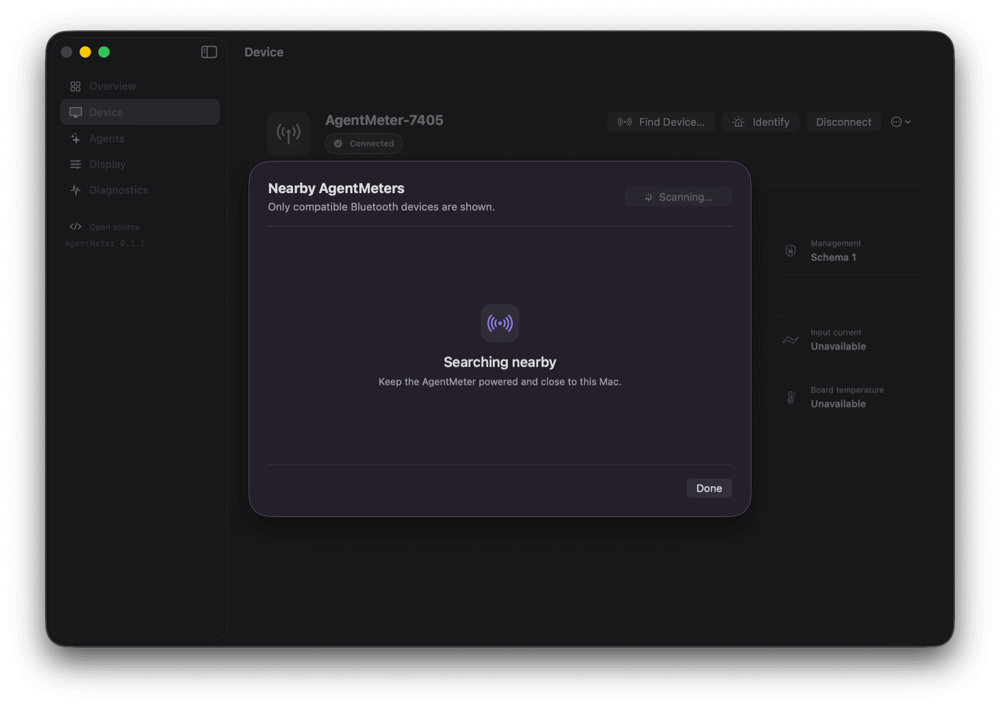

# Setup

The first supported host is macOS 14 or later. The supported display is the Waveshare ESP32-S3-Touch-AMOLED-2.16.

## Prerequisites

- Git and Python 3.11 or later
- A recent CodexBar application and CLI with `codexbar serve`
- The supported display board
- A data-capable USB-C cable
- Bluetooth enabled on the Mac

Install the CodexBar CLI from **CodexBar → Preferences → Advanced → Install CLI**, then confirm:

```bash
codexbar --version
codexbar serve --help
```

Configure and verify Codex, Claude, Gemini, Cursor, or any other supported account inside CodexBar first. AgentMeter does not store those credentials. Cursor can be verified independently with `codexbar --provider cursor --format json --pretty`.

## Prepare AgentMeter

```bash
git clone https://github.com/prabhavalabs/agentmeter.git
cd agentmeter
make setup
mkdir -p "$HOME/.config/AgentMeter"
cp config.example.toml "$HOME/.config/AgentMeter/config.toml"
```

Run the local checks:

```bash
.venv/bin/agentmeter doctor
.venv/bin/agentmeter snapshot --pretty
make lint
make test
```

`snapshot` should print only provider names, health states, quota percentages, reset times, display preferences, and an optional short alert event. It must not contain email addresses, tokens, account IDs, prompts, code, costs, or file paths.

## Flash the display

Connect the board directly to the Mac. No jumper wires or other modules are required.

```bash
.venv/bin/pio device list
make firmware
.venv/bin/pio run -d firmware -e waveshare_amoled_216 \
  --target upload --upload-port /dev/cu.usbmodemXXXX
```

Choose the entry described as `USB JTAG/serial debug unit`, normally with USB vendor ID `303A`. Do not select an unrelated monitor-control or accessory port that also happens to begin with `usbmodem`.

After reboot, the screen shows **Waiting for desktop** and an advertised name such as `AgentMeter-7404`. Optional serial diagnostics are available with:

```bash
.venv/bin/pio device monitor --port /dev/cu.usbmodemXXXX --baud 115200
```

## Pair and test once

The native companion discovers only devices advertising the versioned AgentMeter management
service. Keep the display awake and nearby, then choose **Device → Find Device**. Compatible units
appear with their unique suffix rather than the generic `AgentMeter` configuration name.



For a command-line first test, run:

```bash
.venv/bin/agentmeter send
```

Allow Bluetooth access if macOS prompts. The ESP32 uses encrypted bonding with no PIN because neither device needs to display or type one. On success, the screen changes to the provider overview and the command exits with status zero.

An uncached multi-provider refresh plus first pairing can take up to two minutes. If the first attempt times out while macOS creates the bond, run `agentmeter send` once more.

## Install the background bridge

From the repository root:

```bash
.venv/bin/agentmeter service install --source .
.venv/bin/agentmeter service status
```

Installation creates an isolated runtime under `~/Library/Application Support/AgentMeter`, writes `~/Library/LaunchAgents/com.prabhavalabs.agentmeter.plist`, and starts the bridge immediately. The service uses the configuration in `~/.config/AgentMeter/config.toml` and starts again at login.

Logs are intentionally quiet unless a collection or connection fails:

```bash
tail -f "$HOME/Library/Application Support/AgentMeter/logs/bridge-error.log"
```

After updating AgentMeter, rerun the install command from the new source tree to refresh the isolated runtime.

To stop automatic updates without deleting configuration or logs:

```bash
.venv/bin/agentmeter service uninstall
```

## USB serial fallback

Set an explicit ESP32 port in the host configuration:

```toml
[transport]
preferred = "serial"
device_name = "AgentMeter"
serial_port = "/dev/cu.usbmodemXXXX"
```

Stop the background bridge before using the same serial port manually, then run `agentmeter send` or `agentmeter run`. Serial sends the same validated snapshot followed by a newline and waits for a firmware acknowledgement.

## Device controls

- Tap a provider card to open all of its quota windows.
- Tap the back button to return to the overview.
- Tap the gear beside the pulsing live indicator to choose visible agents, always-on behavior, full-view rotation, and a 3–60 second interval.
- Short-press the top physical button to toggle overview/detail, or advance to the next agent while full-view rotation is enabled.
- Hold the physical button for five seconds to delete saved Bluetooth bonds and advertise for a fresh pairing.

Dashboard settings are stored on the ESP32. A normal firmware upload preserves them; erasing the full flash resets them to all agents visible, normal sleep behavior, full-view off, and a three-second rotation interval.

See [Configuration](configuration.md), [Display interface](ui.md), and [Host bridge](host.md) for details.
