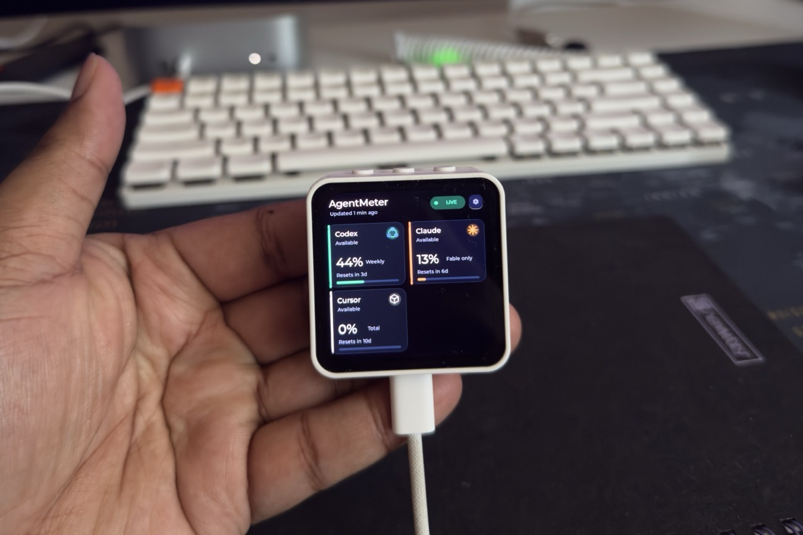
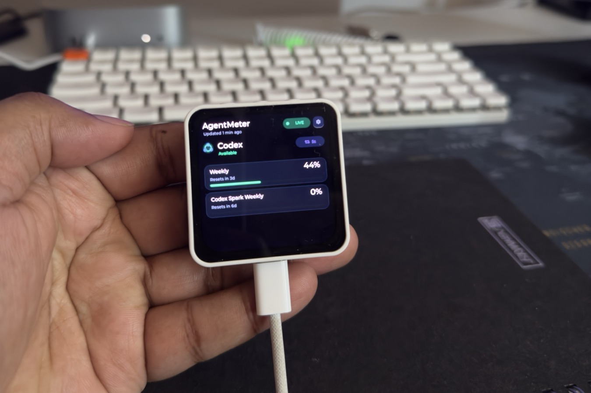
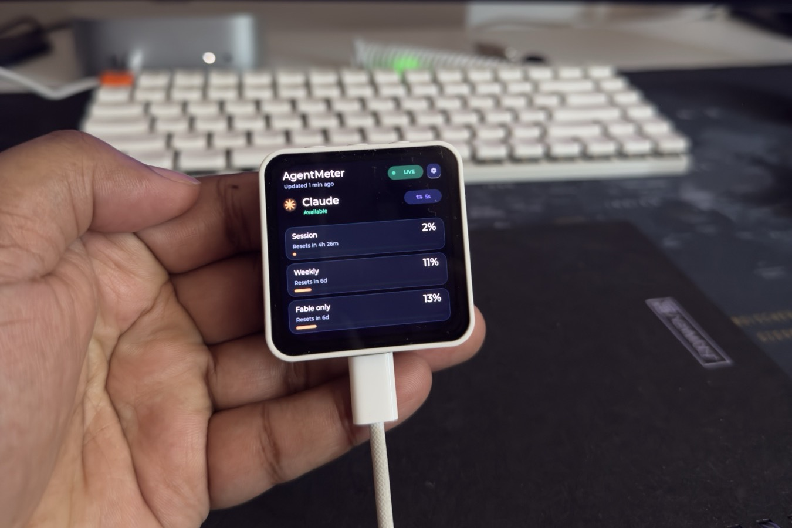
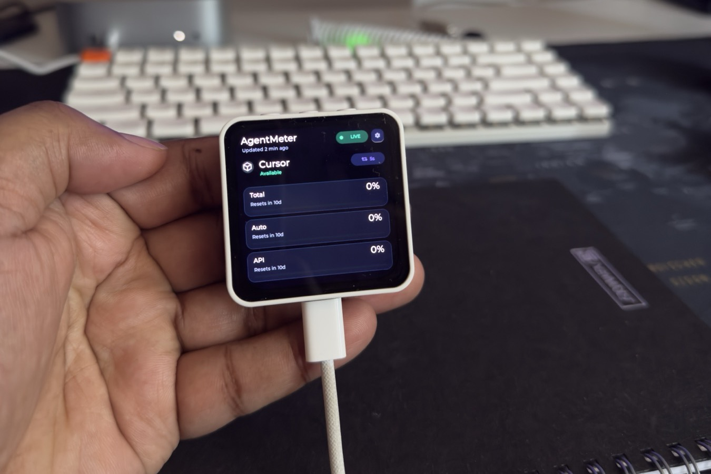
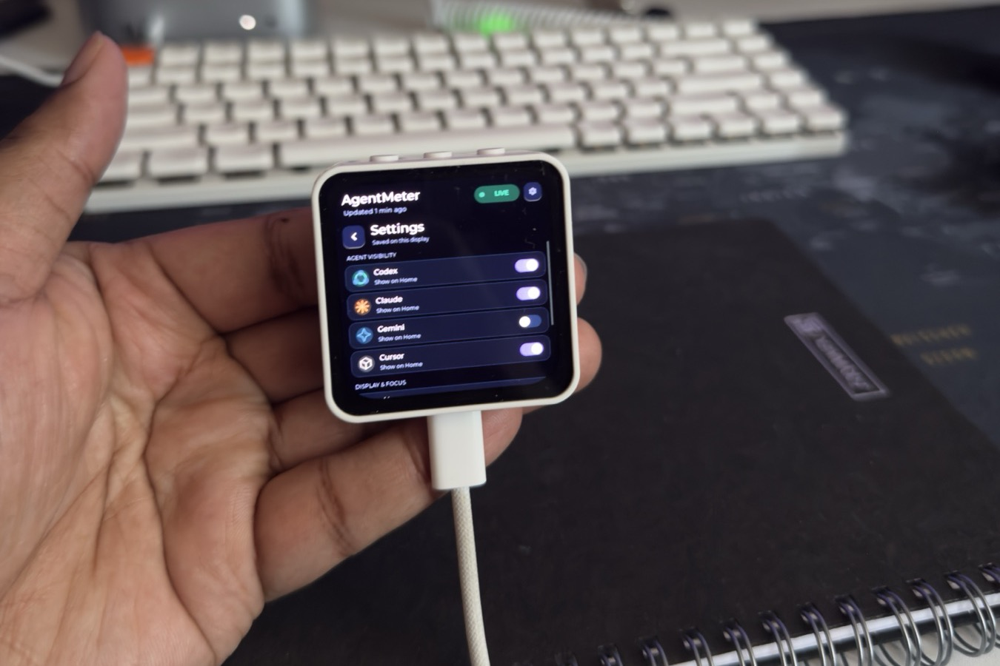

# Display interface

The interface is designed for a 480×480 AMOLED viewed at arm's length. It uses a near-black background, high-contrast type, provider accents, and text alongside every status color.

## Overview

The overview displays only the agents selected on the device and automatically adapts its layout:

- One provider uses a large full-width card.
- Two providers use stacked full-width cards.
- Three or four providers use a two-column grid.
- Five to eight providers continue in the same two-column grid with vertical scrolling.

Each card includes a recognizable provider mark and shows the provider name and health, its most-used quota window, the current percentage, a local reset countdown, and a progress bar. Normal usage uses the provider accent, the first configured threshold turns amber, and the highest threshold turns red.

Codex uses green interlocking arcs, Claude an orange starburst, Gemini a blue sparkle, and Cursor a warm-neutral wireframe cube. Unknown providers receive the shared purple treatment and a generated initial, so future additions remain usable before they gain a dedicated mark.

The header pairs a pulsing status dot with `LIVE` while the bridge is connected. Tap the gear beside it to open Settings.

## Provider detail

Tap a provider to see up to three quota windows at once. Every row keeps its own percentage, progress bar, and reset countdown. Tap the back control to return to the overview.

The top physical button provides the same overview/detail toggle when touch is inconvenient. Detail opens on the first configured provider when entered with the button.

<table>
  <tr>
    <td width="33%"></td>
    <td width="33%"></td>
    <td width="33%"></td>
  </tr>
  <tr>
    <td align="center"><strong>Codex</strong></td>
    <td align="center"><strong>Claude</strong></td>
    <td align="center"><strong>Cursor</strong></td>
  </tr>
</table>

## Settings

Settings are stored in the ESP32's nonvolatile storage and survive ordinary firmware updates and power cycles.

- **Agent visibility:** choose which received providers appear on Home. At least one agent remains selected. Changing this setting does not alter CodexBar or the host configuration.
- **Always on:** bypass the normal dim and screen-off timers. One-pixel shifting remains active for AMOLED protection.
- **Full-view rotation:** replace Home with the polished single-agent detail view and rotate through visible agents only.
- **Rotation interval:** choose 3–60 seconds per agent with the minus and plus controls.

With full-view rotation enabled, a compact loop badge shows the active interval. A short physical-button press advances immediately to the next visible agent. The gear remains available from every dashboard view.

## Connection and data states

The header pill reports:

- `PAIRING` while waiting for the first desktop snapshot
- `LIVE` while the current model has an active transport
- `OFFLINE` after a link loss while retained data is still within its freshness window
- `STALE` once the retained snapshot is older than `staleAfterSeconds`

Offline content is partially faded; stale content is faded further. Provider rows separately report available, delayed, unavailable, or not signed in. Unknown percentages render as `--`, never `0%`.

## Alerts

When a quota window crosses a configured threshold, the display wakes and shows an eight-second bottom banner such as **Claude reached 90%**. Warning and critical banners use amber and red backgrounds. Progress bars continue to carry the warning color after the banner disappears.

Alerts are deduplicated by the host. Multiple simultaneous crossings are queued in severity order. Device audio remains optional and disabled for the first hardware release.

## AMOLED protection

- Brightness defaults to 55%.
- The display dims after five idle minutes by default.
- It turns off after 30 idle minutes by default.
- Lit content shifts through a one-pixel square once per minute.
- Touch, a button press, or an alert wakes the screen.
- Always-on mode bypasses dimming and sleep but retains pixel shifting.

Brightness and default idle timers are configured on the host and arrive with every accepted snapshot. The always-on override is configured and stored on the display.

## Pairing reset

Hold the top physical button for five seconds. The firmware deletes all saved BLE bonds, restarts advertising, wakes the screen, and displays a confirmation banner. A short press never clears pairing.
